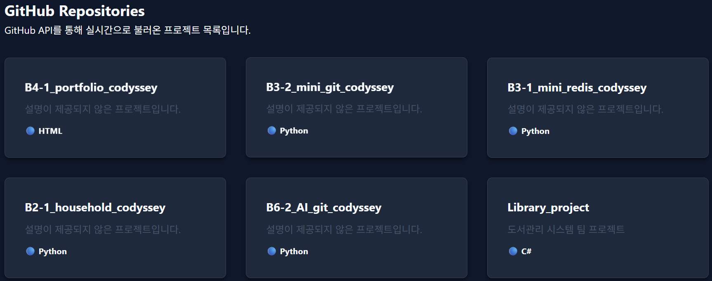

## 1. 프로젝트 목적 및 개요
- HTML, css, javascript를 사용해 포트폴리오 웹사이트 제작하기 

## 2. 과제 학습 내용

### HTML 시맨틱 태그 사용 이유
- 시맨틱 태그란?
    - 웹 페이지 태그에 의미를 부여하는 태그 (의미를 가지는 태그)
        - 기존에는 div, span 등 의미 없는 블록 요소 사용
        - div(블록 형식 분할), span(인라인 형식 분할) 대신 의미 가지는 시맨틱 태그 권장됨
        - 유저 친화적 태그 통해 가독성 높임.
    ```
    header :머리말 (페이지 제목, 소개)
    nav : 하이퍼링크 모아둔 내비게이션
    aside : 본문 흐름에서 벗어난 노트 및 팁
    section : 문서의 장이나 절
    article : 본문과 독립적인 콘텐츠
    footer : 꼬리말 (저자, 저작권 등)
    ```
    

### CSS의 Flexbox와 grid 차이

```css
.navbar {
    display: flex; /* 내부 요소들을 가로로 배치하기 위해 Flexbox 활성화 */
    justify-content: space-between; /* 로고는 왼쪽 끝, 메뉴는 오른쪽 끝으로 양 끝 배치 */
    align-items: center; /* 내부 요소들의 세로 중앙 정렬 */
    padding: 1rem 0; /* 위아래로 1rem(약 16px)의 패딩 부여 */
}

.about-grid, .grid-container {
    display: grid; /* 반응형 바둑판(Grid) 레이아웃 활성화 */
    /* 반응형 핵심: 화면 공간이 허락하는 한 카드를 넣고, 각 카드는 최소 300px에서 최대 가능한 크기(1fr)로 유연하게 늘어남 */
    grid-template-columns: repeat(auto-fit, minmax(300px, 1fr)); 
    gap: 2rem; /* 그리드 항목(카드)들 사이에 위아래, 좌우 2rem 간격 설정 */
    margin-top: 2rem; /* 상단 제목 등과 띄우기 위한 여백 */
}
```
- Flexbox와 grid 모두 특정 요소를 어떻게 배치할지를 결정하는 레이아웃이다.
    - Flexbox : 1차원 (가로 or 세로)만 고려하여 배치
        - justify-content 등 옵션 통해 시스템이 자율적으로 위치 조정
        - 
    - grid : 2차원 (가로 and 세로) 동시 고려하여 배치
        - 화면 크기에 따라 grid 내용이 자동으로 늘거나 줄어듦.
        - 반응형 웹 구현에 이점
        - 


### Dom 사용 흐름 이해하기


### 화살표 함수, 구조분해 할당, 배열 메서드 이해하기


### js의 비동기 처리 이해하기

